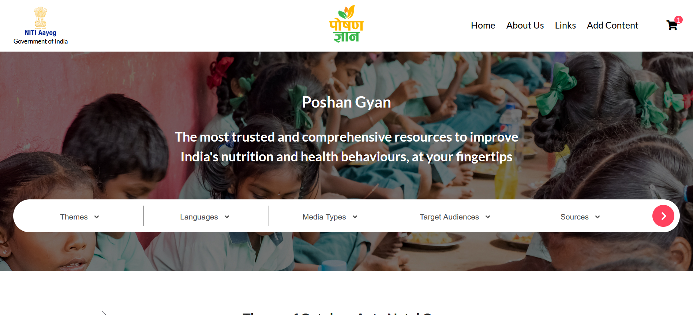
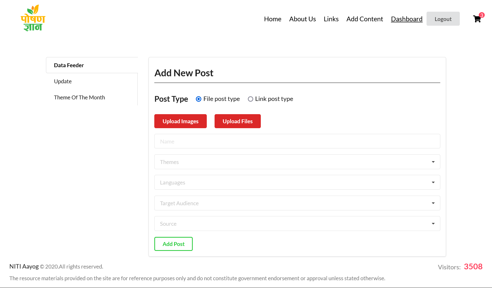
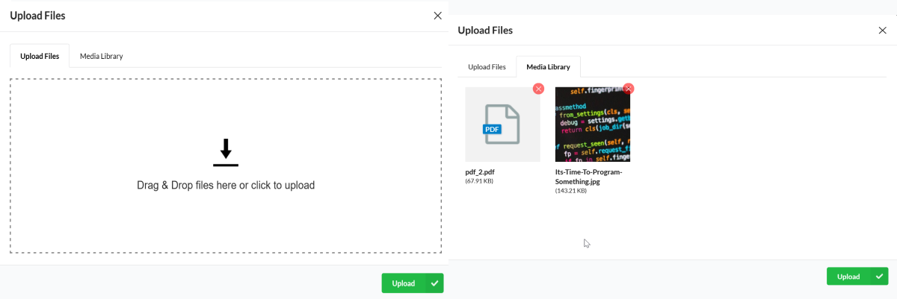
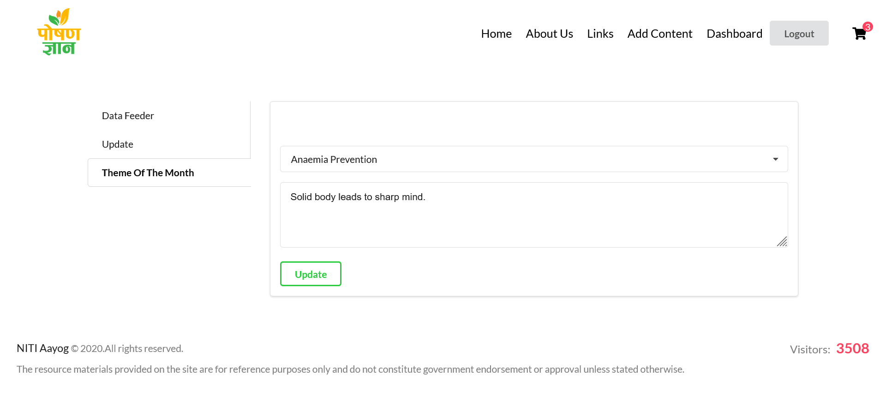

# Poshangyan

Demo link: [https://manikdhanjal.com/projects/poshangyan](https://manikdhanjal.com/projects/poshangyan)

Poshan Gyan is designed to be accessible for everybody to use - whether frontline health workers, community leaders, teachers or anyone else seeking to improve nutritional outcomes. 

It contains materials targeted towards different audiences using a variety of media types. The 'search' toolbar on the homepage will help you find the most relevant materials for your purpose in a simple and easy manner.
d
### Tech Stack
- Front-End - React + Context API
- Back-End - Node.js, Express.js, MongoDB & AWS S3

## Setup

To run it locally -

### Steps to run in development mode:-

0. Create AWS account and create a bucket in AWS S3 and gather AWS credentinals like access ID, access key, bucket name, region.
1. Fork the repo and clone it.
2. Switch to `development` branch for running in development mode.
3. Make sure you have `npm` Node.js & MongoDB installed in your system.
4. [Only once] Run (from the root) `npm install` and `cd frontend && npm install`.
6. Start MongoDB service with `sudo service mongod start`. 
7. Define these env variables in poshangyan/.env file :- 

    | Envoirnment Variables |
    |-----------------------|
    |`NODE_ENV`|
    |`PG_MONGODB_URI`|
    |`PG_JWT_TOKEN`|
    |`PG_PORT`| 
    |`PG_EMAIL_USERNAME`|
    |`PG_EMAIL_PASSWORD`| 
    |`PG_EMAIL_CLIENT_ID`| 
    |`PG_EMAIL_CLIENT_SECRET`| 
    |`PG_EMAIL_REFRESH_TOKEN`|
    |`PG_AWS_ACCESS_KEY_ID`|
    |`PG_AWS_SECRET_ACCESS_KEY`|
    |`PG_AWS_REGION`| 
    |`PG_AWS_BUCKET_NAME`|
    |`PG_TWILIO_ACCOUNT_SID`| 
    |`PG_TWILIO_AUTH_TOKEN`|

8. go to root directory of project `cd ..` and execute `npm run dev` to start the backend and frontend. By default server will run on `port 8000` and frontend on `port 3000`.
9. Go to `http://localhost:3000` to see the application running.

### Steps to run in production mode :-

0. Follow step 0 to 7 as mentioned above.
1. run `cd frontend && npm run build` to create production ready build of react app or run `cd frontend && npm run aws-build` to make build with `/projects/poshangyan/` prefix URL.
2. now you can serve `frontend/build` as static HTML, CSS and JS files.
3. To run server, first go in root folder of project and execute `npm run server` or if you are using pm2 then `pm2 start backend/index.js`.
4. server will start running at `port 8000` if you haven't defined env `PG_PORT`.

## Dashboard Usage

login to dashboard using url `http://localhost:3000/2626/login` and default credentials
|||
|-------|----------------------|
| email | admin@poshangyan.com |
|password | admin@2022 |

### Steps to add contend :-

0. now you go to `Data Feeder` tab and select file type whether is it a embeded youtube video or media file.

1. To Upload files click on `Upload Files` and in `Upload Files` drag and drop files in dotted area and to preview Uploaded files open `Media Library` tab.

2. Select categories of your content and click `Add Post`.

### Steps to modify/add Categories and Content :-

0. Now go to `Update Tab` in dashboard and Click on `Posts` button at top to select the category or post type to modify or delete.

1. To Change Category Click on filter option on top right and select category type.

### Steps to change Theme of month :-

0. Select `Theme of The month tab` in dashboard, content related to theme of the month will appear below banner on homepage.
